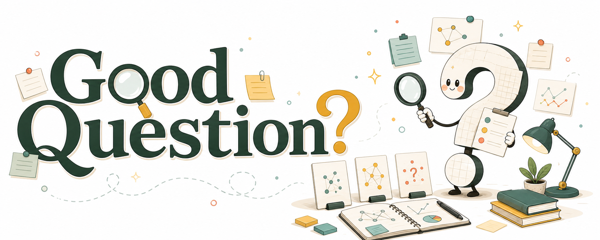

# Good Question

<picture>
  <source srcset="assets/good-question-integrated-banner-1280.webp" type="image/webp">
  
</picture>

<p align="center">
  
  
  
</p>

<p align="center">
  <a href="#zh-cn">中文</a> | <a href="#english">English</a>
</p>

<a id="zh-cn"></a>

## 中文

> 一个把模糊兴趣打磨成清晰、重要、可检验科研问题的可迁移 agent skill。

`good-question` 是一个面向科研选题、问题选择、假设打磨、proposal 压力测试和论文角度重构的可迁移 agent skill。当前仓库按 Codex skill 的目录结构打包，但核心流程和 `references/` 方法卡都是普通 Markdown；只要一个 agent 能读取项目指令和参考文档，就可以把这套方法迁移过去。它不把“头脑风暴”理解为尽可能多地产生点子，而是把研究想法推进到一个更严肃的位置：重要、可行、可证伪、能被同行理解，也经得起评审攻击。

### 为什么需要它

很多弱研究问题并不是因为研究者不努力，而是因为问题本身还没有被锻炼出来：

- 只是发现了一个 gap，却没有说明为什么这个 gap 重要。
- 先爱上了某个方法，再去寻找一个问题。
- 问题太宽，无法落到可观察证据。
- 假设只有一个，没有竞争性解释。
- proposal 看起来很完整，但说不清失败时能学到什么。
- 研究方向跟着热点移动，却没有形成自己的判断力。

`good-question` 的目标是补上这一层科研思维：帮助研究者先问清楚“什么问题值得做”，再讨论“怎么做”。

### 它能做什么

| 使用情境 | skill 会做什么 |
|---|---|
| 只有宽泛兴趣 | 生成候选问题，并区分主题、问题、假设和项目 |
| 有一个初步想法 | 评估重要性、可行性、可证伪性、决策分支和两周 pilot |
| 只有文献 gap | 挑战文献背后的默认假设，而不是只补空白 |
| 需要机制解释 | 拆出竞争性假设和关键判别观察或实验 |
| 准备 proposal 或基金 | 用评审视角压力测试价值、风险、受众、证据路径和反对意见 |
| 项目卡住了 | 通过边界条件、失败信号和条件变化重新定位问题 |

最终输出通常不是一串灵感，而是一张或几张 `Good Question Card`：

```markdown
**Working title:** ...
**Research question:** ...
**Why it matters:** ...
**Core assumption challenged:** ...
**Competing hypotheses:** ...
**Discriminating observation or experiment:** ...
**What would falsify it:** ...
**Two-week pilot:** ...
**Strongest reviewer objection:** ...
**Best next action:** ...
```

### 方法论来源

这个 skill 不是凭空发明的一套提示词。它整合的是一组被科学家、编辑、导师和研究方法论反复强调的共性动作；README 里把这些来源明确写出来，是因为对研究工具来说，方法本身也应该可追溯、可质疑、可替换。

| 模式 | 来源 | 如何影响这个 skill |
|---|---|---|
| 问题选择 | Alon；Fischbach；Stanford Engineering [1][2][3] | 花更长时间选题，比较备选问题，用 decision tree 促进讨论，识别陷阱，接受有价值的风险，不要方法先行 |
| 强推断 | Platt [4] | 生成竞争性假设，并设计能够区分这些假设的观察或实验 |
| 问题化 | Alvesson & Sandberg [5] | 不只补 gap，而是挑战文献中被当成自然、稳定或已解决的默认假设 |
| proposal 压力测试 | Heilmeier Catechism [6] | 追问想改变什么、谁在乎、为什么现在能做、成功是什么、风险在哪里 |
| 科研品味 | Hamming；Nielsen [7][8] | 维护重要问题清单，识别现在可攻击的问题，并长期训练判断力 |
| 问题发展 | Peters [9] | 把问题形成看成一个由文献、不确定性和约束共同塑造的迭代创造过程 |
| 结构化发散 | Orchestra Research [10] | 使用抽象层级移动、张力寻找、边界探测、what changed、跨域类比和利益相关者轮换等 lenses |

### 如何使用

在 Codex 中直接调用：

```text
用 $good-question 帮我把这个粗略想法打磨成一个好的科研问题：
[你的想法]
```

在其他 agent 中，可以把 `SKILL.md` 作为主流程，把 `references/` 作为按需加载的方法卡，再用同样的输入格式启动。

更好的输入格式：

```text
领域：
当前想法或困惑：
已有数据 / 方法 / 资源：
时间限制：
目标：论文 / 开题 / 基金 / pilot / rebuttal
我最担心的问题：
```

也可以这样使用：

```text
用 $good-question 压力测试这个 proposal，重点找评审最可能攻击的地方：
[proposal 摘要]
```

```text
用 $good-question 把这个文献 gap 改写成更有理论贡献的问题：
[gap 描述]
```

```text
用 $good-question 按 strong inference 拆出竞争性假设和关键实验：
[我的假设]
```

### 项目结构

```text
good-question/
  SKILL.md
  README.md
  LICENSE
  agents/
    openai.yaml
  assets/
    good-question-integrated-banner-1280.webp
    good-question-integrated-banner-1280.png
  references/
    alon-problem-choice.md
    fischbach-problem-picking.md
    platt-strong-inference.md
    problematization.md
    heilmeier-catechism.md
    hamming-nielsen-research-taste.md
    peters-question-development.md
    orchestra-lenses.md
```

`SKILL.md` 是轻量主流程。`references/` 中的文件是按需加载的方法卡，避免把所有理论一次性塞进上下文。

### 什么是好问题

在这个项目里，一个 good question 至少要通过六个检查：

1. **It matters.** 回答它会改变理论、方法、实践、政策或下一步研究。
2. **It is specific.** 它不是一个宽泛主题，而是一个可被证据触及的问题。
3. **It has rivals.** 至少存在两个或三个可能解释，而不是只有一个偏爱的假设。
4. **It can fail.** 有结果会削弱、修正或杀死它。
5. **It is feasible enough.** 研究者能在现实约束下启动一个可信 pilot。
6. **It teaches even when negative.** 即使主要假设不成立，也能产生有价值的边界、机制或方法信息。

### 路线图

下一步不只是加更多 prompt，而是继续沉淀更好的科研品味。

- `question-patterns.md`：基于公开来源、匿名化的弱问题到强问题转化模式。
- `editor-desk-reject.md`：研究问题在进入正式评审前常见的失败原因。
- `domain-brief-template.md`：在定制问题生成前，先做联网领域调研的临时流程。
- 继续从主编分享、科学家博客、方法论书籍和研究训练材料中提炼方法卡。

### 理念

`good-question` 是刻意严苛的。

它应该让弱想法变得更弱，不是为了否定它，而是指出它具体失败在哪里。它也应该让强想法变得更锋利，不是装饰它，而是暴露它的假设、竞争解释、检验、风险和下一步行动。

重点不是显得聪明。

重点是提出一个足够好的问题，让下一次实验、下一篇论文、下一份 proposal，甚至下一年的工作，都有一个真实的方向。

<p align="right"><a href="#good-question">回到顶部</a> | <a href="#english">English</a></p>

<a id="english"></a>

## English

> A portable agent skill for turning vague interests into sharp, important, testable scientific questions.

`good-question` is a portable agent skill for research ideation, problem choice, hypothesis sharpening, proposal stress testing, and paper-angle reframing. This repository is packaged in the Codex skill layout, but the core workflow and `references/` cards are plain Markdown; any agent that can read project instructions and reference documents can adapt the methodology. It treats brainstorming as a discipline for making questions more important, tractable, falsifiable, defensible, and worth the next month or year of work.

### Why This Exists

Weak research questions often fail before the experiment starts:

- A literature gap is named, but its importance is not established.
- A method is chosen first, then a question is invented to fit it.
- The question is too broad to touch with observable evidence.
- Only one favored hypothesis is considered.
- A proposal looks complete, but cannot explain what a negative result would teach.
- The agenda follows trends without developing research taste.

`good-question` helps researchers ask "what is worth doing?" before rushing to "how should we do it?"

### What It Does

| Situation | What the skill does |
|---|---|
| Broad interest, no question | Generates candidate questions and separates topic, problem, hypothesis, and project |
| Early idea | Evaluates importance, feasibility, falsifiability, decision branches, and a two-week pilot |
| Literature gap | Challenges the assumptions behind the gap instead of merely filling it |
| Mechanism question | Builds rival hypotheses and discriminating observations or experiments |
| Proposal or grant | Stress-tests value, risk, audience, evidence path, and reviewer objections |
| Stalled project | Reframes through boundary conditions, failure signals, and changed conditions |

The output is usually one or more `Good Question Card`s:

```markdown
**Working title:** ...
**Research question:** ...
**Why it matters:** ...
**Core assumption challenged:** ...
**Competing hypotheses:** ...
**Discriminating observation or experiment:** ...
**What would falsify it:** ...
**Two-week pilot:** ...
**Strongest reviewer objection:** ...
**Best next action:** ...
```

### Methodology

This skill is not a prompt trick. It is built from recurring methodological advice in scientific problem choice, strong inference, problematization, proposal review, and research training. The sources are cited because a research tool should make its own intellectual scaffolding traceable.

| Pattern | Sources | How it shapes the skill |
|---|---|---|
| Problem choice | Alon; Fischbach; Stanford Engineering [1][2][3] | Spend more time choosing the problem, compare alternatives, use decision trees, name traps, accept useful risk, and avoid method-first projects |
| Strong inference | Platt [4] | Generate rival hypotheses and seek observations or experiments that discriminate between them |
| Problematization | Alvesson & Sandberg [5] | Move beyond gap-spotting by challenging assumptions the literature treats as natural or settled |
| Proposal stress test | Heilmeier Catechism [6] | Ask what changes, who cares, why now, what success means, and what risks remain |
| Research taste | Hamming; Nielsen [7][8] | Maintain important-problems lists, look for attackable openings, and cultivate long-term judgment |
| Question development | Peters [9] | Treat question formation as an iterative creative process grounded in literature, uncertainty, and constraints |
| Ideation lenses | Orchestra Research [10] | Use abstraction shifts, tension finding, boundary probing, what-changed analysis, analogy, and stakeholder rotation |

### How To Use

Call the skill directly in Codex:

```text
Use $good-question to sharpen this rough idea into a strong research question:
[your idea]
```

In other agents, use `SKILL.md` as the main workflow and the `references/` files as on-demand method cards, then start with the same input format.

A better input format:

```text
Field:
Current idea or confusion:
Available data / methods / resources:
Time constraint:
Target: paper / thesis proposal / grant / pilot / rebuttal
My biggest concern:
```

Other useful prompts:

```text
Use $good-question to stress-test this proposal and identify the objections reviewers are most likely to raise:
[proposal summary]
```

```text
Use $good-question to turn this literature gap into a question with stronger theoretical contribution:
[gap description]
```

```text
Use $good-question to apply strong inference: build rival hypotheses and discriminating experiments for this claim:
[hypothesis]
```

### Project Structure

```text
good-question/
  SKILL.md
  README.md
  LICENSE
  agents/
    openai.yaml
  assets/
    good-question-integrated-banner-1280.webp
    good-question-integrated-banner-1280.png
  references/
    alon-problem-choice.md
    fischbach-problem-picking.md
    platt-strong-inference.md
    problematization.md
    heilmeier-catechism.md
    hamming-nielsen-research-taste.md
    peters-question-development.md
    orchestra-lenses.md
```

`SKILL.md` keeps the main workflow lightweight. The `references/` cards are loaded only when needed, so the skill can use serious methodology without flooding the context window.

### What Counts As A Good Question

In this project, a good question should pass at least six checks:

1. **It matters.** Answering it would change theory, method, practice, policy, or the next research step.
2. **It is specific.** It is not just a broad topic; evidence can touch it.
3. **It has rivals.** At least two plausible explanations could compete.
4. **It can fail.** Some result could weaken, revise, or kill the idea.
5. **It is feasible enough.** A credible pilot can start under real constraints.
6. **It teaches even when negative.** Failure still clarifies a boundary, mechanism, or method.

### Roadmap

The next improvement is not more prompts. It is better research taste.

- `question-patterns.md`: public-source, anonymized patterns for turning weak questions into stronger ones.
- `editor-desk-reject.md`: common reasons research questions fail before review.
- `domain-brief-template.md`: a workflow for doing web-based, field-specific research before customizing question generation.
- More source cards from editorials, scientist blogs, methodology books, and research training materials.

### Philosophy

`good-question` is deliberately demanding. It should make weak ideas weaker by showing exactly where they fail, and make strong ideas sharper by exposing their assumptions, rivals, tests, risks, and next actions.

The point is not to sound clever. The point is to ask a question good enough that the next experiment, paper, proposal, or year of work has somewhere real to go.

<p align="right"><a href="#good-question">Back to top</a> | <a href="#zh-cn">中文</a></p>

## References / 参考文献

The references below are cited as methodological sources for the skill, not as decoration. Journal articles use an APA-like format; web pages include a stable URL and retrieval date when no publication date is explicit.

1. Alon, U. (2009). How to choose a good scientific problem. *Molecular Cell, 35*(6), 726-728. https://doi.org/10.1016/j.molcel.2009.09.013
2. Fischbach, M. A. (2024). Problem choice and decision trees in science and engineering. *Cell, 187*(10), 2363-2367. https://doi.org/10.1016/j.cell.2024.03.012
3. Stanford Engineering. (2024, October 23). How to pick and solve the next great problem. https://engineering.stanford.edu/news/how-pick-and-solve-next-great-problem
4. Platt, J. R. (1964). Strong inference. *Science, 146*(3642), 347-353. https://doi.org/10.1126/science.146.3642.347
5. Alvesson, M., & Sandberg, J. (2011). Generating research questions through problematization. *Academy of Management Review, 36*(2), 247-271. https://doi.org/10.5465/amr.2009.0188
6. DARPA. (n.d.). The Heilmeier Catechism. Retrieved June 1, 2026, from https://www.darpa.mil/about/heilmeier-catechism
7. Hamming, R. W. (1986). You and your research. Bell Communications Research colloquium. https://www.cs.virginia.edu/~robins/YouAndYourResearch.html
8. Nielsen, M. (2004). Principles of effective research. https://michaelnielsen.org/blog/principles-of-effective-research/
9. Peters, M. A. K. (2025). How to develop good research questions. *Nature Human Behaviour*. https://doi.org/10.1038/s41562-025-02292-5
10. Orchestra Research. (n.d.). Research Idea Brainstorming. *AI-Research-SKILLs*. Retrieved June 1, 2026, from https://github.com/Orchestra-Research/AI-Research-SKILLs/blob/main/21-research-ideation/brainstorming-research-ideas/SKILL.md
